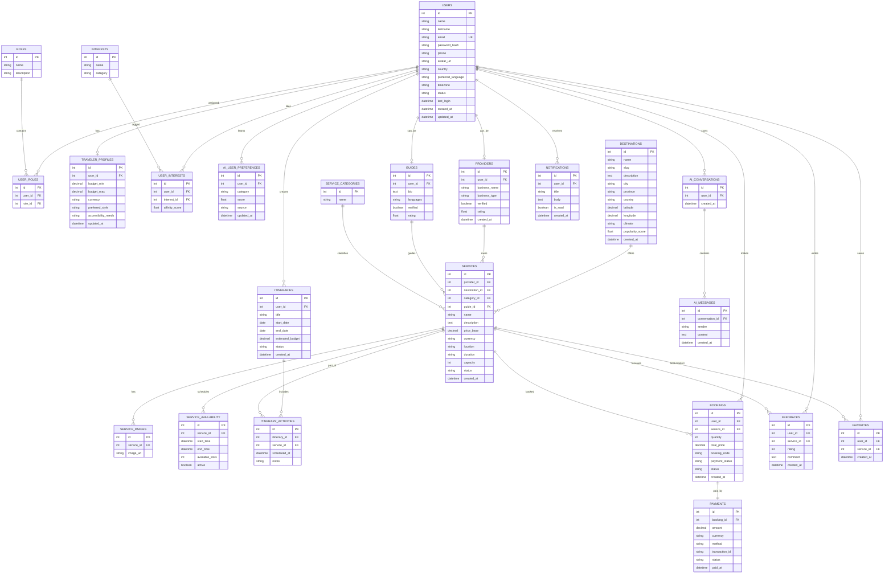

```mermaid
erDiagram

    USERS {
        int id PK
        string name
        string lastname
        string email UK
        string password_hash
        string phone
        string avatar_url
        string country
        string preferred_language
        string timezone
        string status
        datetime last_login
        datetime created_at
        datetime updated_at
    }

    ROLES {
        int id PK
        string name
        string description
    }

    USER_ROLES {
        int id PK
        int user_id FK
        int role_id FK
    }

    TRAVELER_PROFILES {
        int id PK
        int user_id FK
        decimal budget_min
        decimal budget_max
        string currency
        string preferred_style
        string accessibility_needs
        datetime updated_at
    }

    INTERESTS {
        int id PK
        string name
        string category
    }

    USER_INTERESTS {
        int id PK
        int user_id FK
        int interest_id FK
        float affinity_score
    }

    AI_USER_PREFERENCES {
        int id PK
        int user_id FK
        string category
        float score
        string source
        datetime updated_at
    }

    DESTINATIONS {
        int id PK
        string name
        string slug
        text description
        string city
        string province
        string country
        decimal latitude
        decimal longitude
        string climate
        float popularity_score
        datetime created_at
    }

    PROVIDERS {
        int id PK
        int user_id FK
        string business_name
        string business_type
        boolean verified
        float rating
        datetime created_at
    }

    GUIDES {
        int id PK
        int user_id FK
        text bio
        string languages
        boolean verified
        float rating
    }

    SERVICE_CATEGORIES {
        int id PK
        string name
    }

    SERVICES {
        int id PK
        int provider_id FK
        int destination_id FK
        int category_id FK
        int guide_id FK
        string name
        text description
        decimal price_base
        string currency
        string location
        string duration
        int capacity
        string status
        datetime created_at
    }

    SERVICE_IMAGES {
        int id PK
        int service_id FK
        string image_url
    }

    SERVICE_AVAILABILITY {
        int id PK
        int service_id FK
        datetime start_time
        datetime end_time
        int available_slots
        boolean active
    }

    ITINERARIES {
        int id PK
        int user_id FK
        string title
        date start_date
        date end_date
        decimal estimated_budget
        string status
        datetime created_at
    }

    ITINERARY_ACTIVITIES {
        int id PK
        int itinerary_id FK
        int service_id FK
        datetime scheduled_at
        string notes
    }

    BOOKINGS {
        int id PK
        int user_id FK
        int service_id FK
        int quantity
        decimal total_price
        string booking_code
        string payment_status
        string status
        datetime created_at
    }

    PAYMENTS {
        int id PK
        int booking_id FK
        decimal amount
        string currency
        string method
        string transaction_id
        string status
        datetime paid_at
    }

    FEEDBACKS {
        int id PK
        int user_id FK
        int service_id FK
        int rating
        text comment
        datetime created_at
    }

    FAVORITES {
        int id PK
        int user_id FK
        int service_id FK
        datetime created_at
    }

    NOTIFICATIONS {
        int id PK
        int user_id FK
        string title
        text body
        boolean is_read
        datetime created_at
    }

    AI_CONVERSATIONS {
        int id PK
        int user_id FK
        datetime created_at
    }

    AI_MESSAGES {
        int id PK
        int conversation_id FK
        string sender
        text content
        datetime created_at
    }

    USERS ||--o| TRAVELER_PROFILES : has
    USERS ||--o{ USER_ROLES : assigned
    ROLES ||--o{ USER_ROLES : contains

    USERS ||--o{ USER_INTERESTS : likes
    INTERESTS ||--o{ USER_INTERESTS : tagged

    USERS ||--o{ AI_USER_PREFERENCES : learns

    USERS ||--o| PROVIDERS : can_be
    USERS ||--o| GUIDES : can_be

    DESTINATIONS ||--o{ SERVICES : offers
    PROVIDERS ||--o{ SERVICES : owns
    GUIDES ||--o{ SERVICES : guides
    SERVICE_CATEGORIES ||--o{ SERVICES : classifies

    SERVICES ||--o{ SERVICE_IMAGES : has
    SERVICES ||--o{ SERVICE_AVAILABILITY : schedules

    USERS ||--o{ ITINERARIES : creates
    ITINERARIES ||--o{ ITINERARY_ACTIVITIES : includes
    SERVICES ||--o{ ITINERARY_ACTIVITIES : part_of

    USERS ||--o{ BOOKINGS : makes
    SERVICES ||--o{ BOOKINGS : booked

    BOOKINGS ||--|| PAYMENTS : paid_by

    USERS ||--o{ FEEDBACKS : writes
    SERVICES ||--o{ FEEDBACKS : receives

    USERS ||--o{ FAVORITES : saves
    SERVICES ||--o{ FAVORITES : bookmarked

    USERS ||--o{ NOTIFICATIONS : receives

    USERS ||--o{ AI_CONVERSATIONS : starts
    AI_CONVERSATIONS ||--o{ AI_MESSAGES : contains
```
